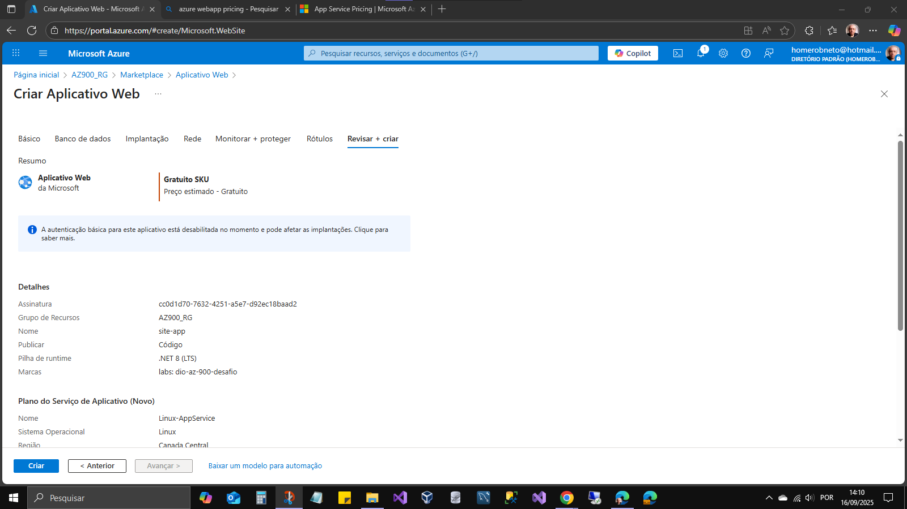
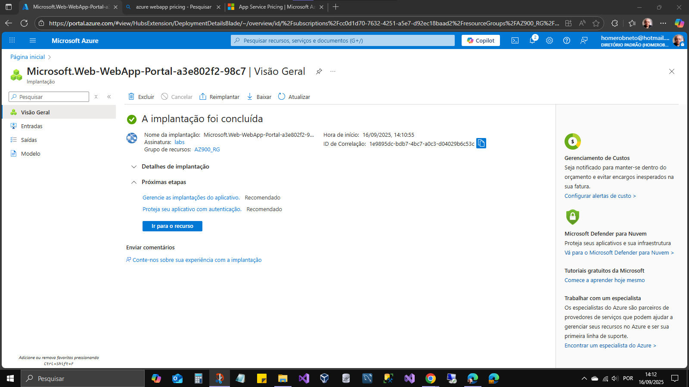
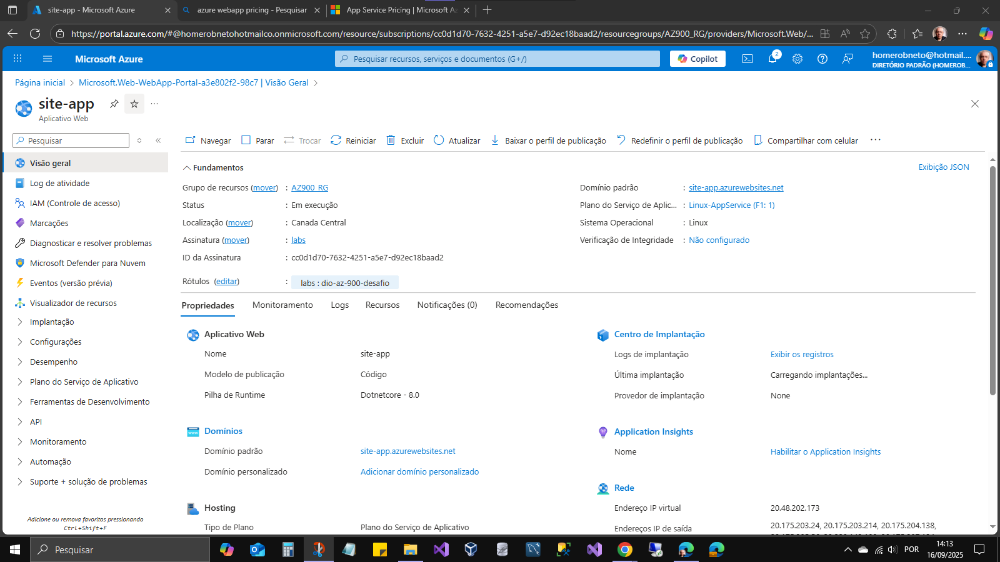

# Az-900 : Desafio 01

Criado um grupo de recurso: AZ900_RG, para organizar os recursos de infra.
No RG AZ900_RG, também foi implantado uma instância de serviço de aplicativos (WebApp) na camada de preços gratuita para futuro teste de uma API.

```
Serviço de aplicativos - Linux-AppService (F1: 1)
Runtime .net8 LTS
```







visitar perfil: <a href="https://learn.microsoft.com/pt-br/users/homeroneto-0941" target="_blank">learn.microsoft.com</a>

- [voltar ao inicio](../README.md)