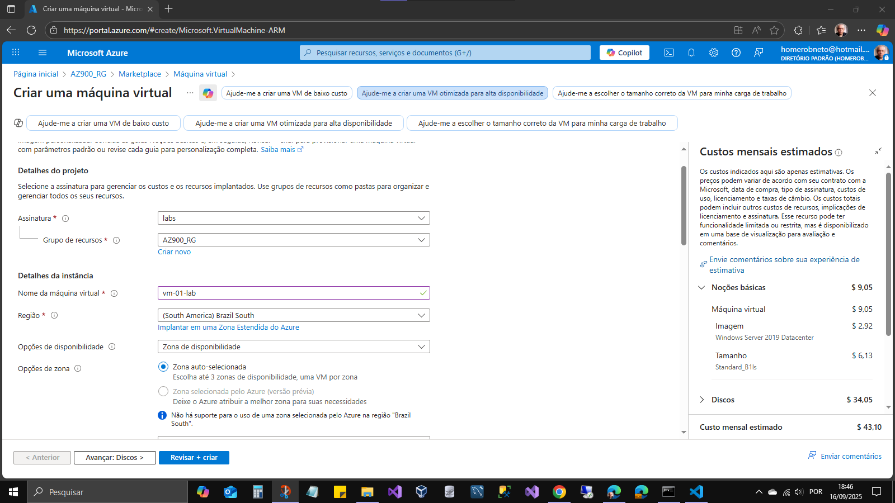

# Az-900 : Desafio 02

Conteúdos:

- Implantar VM no Portal do Azure;
- Questionar as necessidades do cenário para determinar:
  - caso seja ambiente de produção em periodo de alto fluxo de acessos então configurar conjunto de dimensionamento de VMs, determinar configuração necessária e escala automática;
  - Computação adequada;
  - SO adequado;
  - Configurações de segurança;
  - Adicionar armazenamento(Disco);
  - Marcar recursos associados à VM;
  - Configurar monitoramento e alertas;

visitar perfil: <a href="https://learn.microsoft.com/pt-br/users/homeroneto-0941" target="_blank">learn.microsoft.com</a>

- [voltar ao inicio](../README.md)
